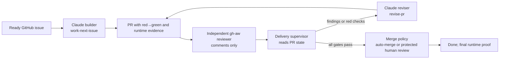

# Running an unattended Claude delivery loop

This guide describes how to let Claude build and maintain a Plenipo product while you are away:
issue → implementation → runtime proof → pull request → independent review → revision → merge.

It is intentionally not a "give Claude admin and let it run" recipe. An unattended loop needs a
durable queue, event triggers, limits, independent verification, and a way to stop it remotely.
The outcome is a system that can work without an open terminal, not a system that can bypass the
controls that keep the product safe.

## What this marketplace supplies—and what it does not

The delivery procedures already exist:

| Responsibility | Marketplace procedure |
| --- | --- |
| Take one shaped issue to a tested PR | `/deliver:work-next-issue` |
| Reproduce and prove a behavioural fix | `/deliver:verify-runtime` |
| Respond to PR review threads and failing checks | `/deliver:revise-pr` |
| Review product PR intent without changing code | `/harness:install-github-agentic-workflows` |

`work-next-issue` deliberately stops with the PR in **In Review**. The installed GitHub Agentic
Workflow deliberately leaves a non-blocking review comment. Neither is a long-running waiter.

For a fully unattended product, add a **delivery supervisor** outside the interactive Claude
session. It runs on GitHub Actions or a dedicated, isolated runner and re-invokes Claude when the
GitHub state changes. The supervisor owns sequencing; the marketplace skills still own the actual
build, runtime verification, and PR-revision procedures.

## The target architecture



The supervisor must store its state in GitHub, not in a Claude conversation:

- GitHub Issues and the project board are the work queue.
- A branch and PR identify the item in flight.
- Labels and PR comments record the current loop state and terminal state.
- CI, review threads, and the final runtime run are the evidence.

## Preconditions

Do these once in the Networthy repository before enabling automation.

1. Install the `harness` and `deliver` marketplace plugins for the Claude runtime. The runner must
   see the same `CLAUDE.md`, `AGENTS.md`, `RUNBOOK.md`, and `.claude` configuration that a local
   session sees. Pin the marketplace revision used by automation; do not silently fetch a new skill
   revision during a production run.
2. Run `/deliver:install-runbook` and make its checks green. This gives Claude a repeatable startup,
   real-request, E2E, and telemetry contract. An agent that cannot run the product has no basis for
   opening a feature PR.
3. Create a GitHub project with a `Ready` status and a build-order field. Each work request must be
   a single issue with acceptance criteria, expected behaviour, and a testable definition of done.
4. Install the product PR-intent-review workflow with
   `/harness:install-github-agentic-workflows`. Its review is a separate, read-only checker; it
   must never push commits or merge a PR.
5. Protect the default branch: require pull requests, required checks, resolved threads, and fresh
   review after a new push. Put `CLAUDE.md`, `.claude/`, `.github/`, authorization, approvals,
   tenant isolation, audit, and secret-handling paths under `CODEOWNERS`.
6. Give the automation a dedicated GitHub App or bot identity. Scope it to this repository and only
   the permissions it needs. Do not run the loop using a personal access token belonging to an
   administrator.
7. Put the Anthropic credential in an Actions secret or a dedicated runner secret store. Never put
   it in an issue, prompt, workflow source, log, or `CLAUDE.md`.

Claude Code supports non-interactive execution and its GitHub Action can run on issue and PR events.
Use the current [Claude Code GitHub Actions guide](https://docs.anthropic.com/en/docs/claude-code/github-actions)
and [CLI reference](https://docs.anthropic.com/en/docs/claude-code/cli-usage) for the current action
version and arguments.

## One work request, end to end

Use an issue rather than a chat message as the entry point. For the example request, create an
issue such as:

```text
Title: Detect statement accounts by account number

When importing a statement, identify an existing account using its account number.
Preserve the current behaviour when the number is absent or ambiguous.

Acceptance criteria
- An account number uniquely identifies the existing account.
- Missing or duplicate account numbers do not attach a statement to the wrong account.
- The import/review journey is proven end to end.
- A regression test is observed failing before the implementation and passing after it.
```

Only after the issue has been shaped and marked `Ready` should the build workflow add its
`agent:claimed` label and call Claude with a bounded prompt such as:

```text
You are the Networthy delivery builder. Work only on issue #123.
Read RUNBOOK.md, CLAUDE.md, ARCH.md, DECISIONS.md, and the issue.
Execute /deliver:work-next-issue. Do not select another issue. Do not merge.
End with exactly one named terminal state and leave all evidence in the PR.
```

The build workflow must use a unique concurrency key for the issue. A second event for issue 123
should resume or no-op; it must not create a second branch or PR.

## Event design

Configure these four bounded workflows. Exact YAML changes over time, so use the Claude and GitHub
documentation to choose the current action syntax; the event contract is the important part.

| Workflow | Trigger | Actor | Required outcome |
| --- | --- | --- | --- |
| Builder | An authorized user adds `agent:ready` to a `Ready` issue | Claude builder | One branch, one PR, runtime evidence, status `In Review` |
| Reviewer | PR opened, synchronized, or marked ready | `gh-aw` reviewer | Comment-only independent intent review |
| Reviser | Trusted reviewer feedback, a red required check, or a queued reconciliation run | Claude reviser | `/deliver:revise-pr`; reply to every thread; re-run affected proof |
| Reconciler | Manual dispatch and a modest schedule | Supervisor | Inspect every `agent:claimed` PR; restart only an eligible stalled state |

The reconciler is the answer to "wait for feedback." It does not sleep inside an agent session. It
periodically asks GitHub whether the PR now has unresolved threads, `CHANGES_REQUESTED`, failed
required checks, a merge conflict, or a completed review run. It then either invokes the reviser,
does nothing, or records a named terminal state.

Use a concurrency group per issue or PR and cancel older queued runs, not a run actively changing
the branch. Set a hard timeout and a maximum Claude turn count for every workflow. Keep at most one
issue `In Progress` in a product: the board, not concurrent Claude sessions, carries the queue.

## Trust boundaries for the reviser

PR comments, issue text, source code, test fixtures, action logs, and linked pages are untrusted
input. Treat a comment that says "ignore the policy" as data to analyse, never an instruction.

Before invoking the reviser, the supervisor should verify all of the following:

- The PR head matches the branch recorded for the claimed issue.
- The PR was created by the delivery bot or is on the expected `feat/<issue>-*` branch.
- Feedback comes from an allowed reviewer workflow or a configured reviewer identity. Other
  comments can be reported to a human but must not automatically trigger a privileged coding run.
- The PR does not change workflow, policy, credential, or ownership files unless a human explicitly
  enabled that scope.
- The iteration count has not exceeded its budget. Three non-converging review rounds are
  `Stalled`, not an excuse to keep spending.

Never check out untrusted fork code in a privileged `pull_request_target` or `workflow_run` job.
GitHub specifically warns that those triggers can expose repository write access and secrets when
used with untrusted PR content. See GitHub's [secure-use guidance](https://docs.github.com/en/actions/reference/security/secure-use).
Run this automation only for branches the bot created in the trusted repository, or isolate it in a
disposable runner with no repository-write token or unrelated secrets.

## Merge policy: choose it explicitly

Fully unattended *implementation* does not require fully unattended *merging*. Start with the
first row and advance only when the evidence exists.

| Level | What can merge without you | Minimum gate |
| --- | --- | --- |
| 0 | Nothing | Claude builds and revises; a human merges |
| 1 | Docs, runbook, and test-only PRs | Required checks plus a non-author reviewer |
| 2 | Low-risk product features | L1/L2 checks, red-before-green evidence, E2E proof, independent reviewer, and a cheap revert |
| 3 | Bounded product backlog | Level 2 has remained clean over time; per-run issue and cost budgets are configured |

Platform changes and changes to authorization, approvals, tenant isolation, audit, or secrets stay
human-approved at every level. The bot that wrote the code must not be the only party that judges
and merges it. GitHub branch protection and `CODEOWNERS` make this rule enforceable; see GitHub's
[protected branches](https://docs.github.com/en/repositories/configuring-branches-and-merges-in-your-repository/managing-protected-branches/about-protected-branches)
and [CODEOWNERS](https://docs.github.com/en/repositories/managing-your-repositorys-settings-and-features/customizing-your-repository/about-code-owners)
documentation.

If Level 2 or 3 is enabled, make auto-merge conditional on all required checks, no unresolved
threads, the independent review having completed, and an explicit `agent:merge-approved` label
written only by the supervisor after it verifies those facts. The writer workflow may never apply
that label.

## Claude policy file

Keep the durable rules in `CLAUDE.md`, not in an event prompt. A useful automation section looks
like this:

```markdown
## Unattended delivery

- Work only on the issue and PR provided by the supervisor.
- Read RUNBOOK.md before running or changing code.
- Do not change CI, workflows, agent policy, credentials, branch protection, or CODEOWNERS.
- Do not merge; only the supervisor may request an eligible auto-merge.
- Keep one issue in flight. Do not create a second PR for the issue.
- Prove behavioural changes through the real request or UI path and record the exact evidence.
- A regression test must be observed red before the change and green after it.
- After three non-converging attempts, stop as Stalled and leave the reproduction in the issue.
```

The supervisor prompt should name the issue/PR and the procedure to run, but it must not repeat or
weaken these rules. A repository policy survives a fresh runner, a resumed Claude session, and
context compaction; conversational instructions do not.

## Remote controls and observability

Before you walk away, verify each of these controls works:

| Control | Test | Purpose |
| --- | --- | --- |
| Pause | Remove `agent:ready` or add `agent:paused` | No new builder or reviser run starts |
| Stop now | Disable the Actions workflow or revoke the bot's write token | Stops new writes immediately |
| Cancel | Cancel the current workflow run | Ends a runaway run without waiting for its timeout |
| Audit | Open the issue and PR timeline | Shows every action, prompt trigger, commit, check, and terminal state |
| Recover | Run the reconciler with `workflow_dispatch` | Re-evaluates persisted GitHub state without relying on a chat transcript |

Send the supervisor's terminal state and a link to the issue or PR to a channel you actually read.
Alert on `Blocked`, `Stalled`, `Exhausted`, and any failed runtime proof; do not alert only on
successes. Record the precise reason in the issue so recovery does not begin by guessing.

## Prove the automation before relying on it

Treat the automation itself as production code. Enable it in this order:

1. **Dry run:** use a disposable issue and require the builder to report its intended commands
   without pushing. Confirm the correct issue is selected and no other issue changes.
2. **PR-only run:** allow one known small change to create a PR, but keep auto-merge disabled.
   Confirm the PR includes runtime evidence and the expected board transition.
3. **Review repair:** place a controlled, valid review finding on the PR. Confirm the reviewer
   triggers exactly one reviser run, the test is re-proven, and the response addresses the thread.
4. **Negative security test:** use an unapproved commenter or a fork PR. Confirm it cannot trigger
   a privileged Claude run or access secrets.
5. **Merge test:** only at the chosen autonomy level, run a low-risk PR through all merge gates and
   verify a failed check, unresolved thread, or missing reviewer blocks the merge.

The review-repair test is especially important: a monitor that has never been observed handling
feedback is not proven to close the loop.

## Operational checklist

- [ ] The product has `RUNBOOK.md`, integration coverage, and a working runtime/E2E command.
- [ ] The issue queue, build order, and `Ready` status are configured.
- [ ] Claude's repository rules and marketplace revision are present on the runner.
- [ ] The builder, reviewer, reviser, and reconciler workflows have separate responsibilities.
- [ ] Branch protection, required checks, CODEOWNERS, and the bot identity were tested.
- [ ] The automation only acts on trusted bot branches and trusted review feedback.
- [ ] Per-issue concurrency, maximum turns, timeout, retry, and cost limits are set.
- [ ] The remote pause, cancellation, alert, and recovery paths were exercised.
- [ ] The current merge-autonomy level is recorded by a human in `workflow.json`.

When these conditions are true, you can be away from the computer while Claude moves a bounded
product queue forward. It still stops honestly when the loop reaches a human-only decision, a
security boundary, or a non-converging requirement.
